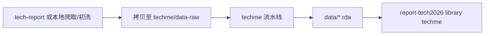

# 报告项目联动

## 何时使用

- 在年度报告仓与 techme 之间拷贝数据
- 确定某数据集应在哪个项目维护
- 报告端引用 techme 标准数据集

## 项目职责边界

| 项目 | 路径 | 职责 |
|------|------|------|
| **report-tech2026** | `D:/github/report-tech2026` | 2026 年报 Quarto 写作、章节分析与可视化（当前主写作仓） |
| **tech-report** | `D:/github/tech-report` | 历史/旁路爬取与初洗、部分公开站脚本 |
| **techme** | `D:/github/techme`（本仓库） | 标准化 `.rda` 数据集发布、年鉴/公开数据 ETL 流水线 |
| **report-tech2025** | `D:/github/report-tech2025` | 2025 年报归档仓 |

原则：**techme 是数据的 canonical 来源**；报告仓消费 `library(techme)`。

## 数据流向



## 拷贝路径约定

### 爬取项目 → techme

爬取/初洗完成后，拷贝至 techme 对应目录：

```
D:/github/tech-report/data-raw/public-site/{source}/xlsx/
  → D:/github/techme/data-raw/data-tidy/{source}/xlsx/

D:/github/tech-report/data-raw/public-site/{source}/xlsx/tbl-json-{Year}.rds
  → 同上或 techme 清洗脚本输入路径
```

示例（moa-seed-firm，见 `data-raw/public-site/moa-seed-firm/code-01-scrape-seed-firm.R`）：

```r
# path_to <- glue("D:/github/tech-report/data-raw/public-site/moa-seed-firm/xlsx/tbl-json-{Year}.rds")
```

### techme → report-tech2026

报告端安装并加载（建议钉 tag）：

```r
# remotes::install_github("huhuaping/techme@v1.0.0")
library(techme)
data(RDPatentValid)
```

审计脚本：`scripts/audit-year-coverage-2026.R`。2026 报告覆盖审计见 `report-tech2026/report/data-coverage-audit-2026.md`。

## 仅在一方维护的数据集

| 数据集 | 维护位置 | 说明 |
|--------|----------|------|
| `open-share`（科研仪器开放共享） | tech-report only | `tech-report/data-raw/public-site/most-jcs-open-share` |
| 章节专属中间分析 / AI 大模型案例表 | report-tech2026 | 不进入标准 `.rda`，稳定后再考虑入库 |

新增数据集时先确认是否纳入 techme 发布范围。

## 天眼查数据流

1. 报告侧爬取机构名单 → 输出至 techme ship 目录
2. techme `wfl.queryInstituton()` 匹配省份
3. 未匹配导出：`data-raw/data-tidy/hack-tianyan/ship/`

详见 `vignettes/articles/queryTianyancha.Rmd`。

## 同步检查清单

- [ ] 明确数据 canonical 来源（techme vs 报告仓 only）
- [ ] 拷贝路径两端目录结构一致
- [ ] techme 流水线已跑完，`data/*.rda` 含最新年份
- [ ] report-tech2026 中 `library(techme)` 版本与 tag 一致（`renv`）
- [ ] 未将报告仓中间文件误提交至 techme git

## 参考

- 公开数据 Skill：`.cursor/skills/techme-public-site-update/SKILL.md`
- 年鉴更新 Skill：`.cursor/skills/techme-yearbook-update/SKILL.md`
- 历史导入注释：`data-raw/wfl_import.R`
- 设计文档：`vignettes/articles/pkg-design.Rmd`
